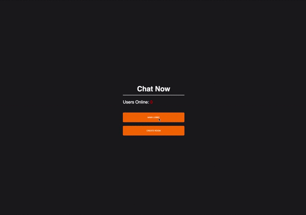

# PrivateGroupChat
This is a demo proof of concept 
 
**Here is the link to my live site**
-- https://www.1234.ie/ -- **OFFLINE** :( 
-- http://1234.ie/ -- **ONLINE** :) 

(if the link is down)

Please download the code and run npm instrall in the client and server folders. 
then go to your localhost and port 3000 to see the application. 

Or download my **JenkinsFile** and run it yourself :) 

